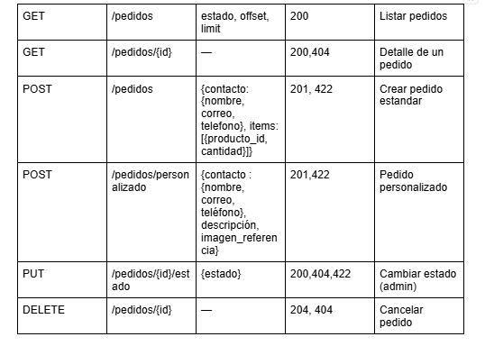

Juan José Baloco Sánchez 
David Astudillo palma 
santiago vivas amaya

Link del repositorio:

 https://github.com/juanbaloco/Proyecto-Origami-EDYA2- 

1) 
    Problema. Personas y negocios quieren figuras de origami 3D pero no encuentran un catálogo claro ni un proceso sencillo para pedir o personalizar. Solución. Una SPA (React) con catálogo y pedidos, y un backend FastAPI con gestión de clientes y pedidos. Para quién. Clientes finales (regalos/decoración), comercios (volumen/branding) y taller (gestión interna).
    Usuarios & 5 casos de uso

    Cliente: Navegar catálogo y ver detalles de producto.
    Cliente: Realizar un pedido estándar (checkout).
    Cliente: Realizar pedido personalizado (formulario).
    Cliente: Realizar un pedido de un producto no disponible (formulario).
    Cliente: visualizar un carrito de compra, agregar o eliminar productos.
    Cliente: Consultar el estado del pedido (revisión, elaborando, terminado, despachado).
    Cliente: Opción de fidelización al completar un pedido, registrarse en un programa de beneficios con información adicional (nombre completo, correo, redes sociales, fecha de nacimiento), para acceder a:
        Tutoriales exclusivos de origami
        Acumulación de puntos por compras
        Regalos por cierto tiempo en la comunidad.

    Administrador:
        Gestionar catálogo de productos:
            Crear, actualizar, eliminar productos e imágenes.
        Visualizar pedidos realizados:
            Revisar pedidos estándar, personalizados y de productos no disponibles.
        Gestionar estado de pedidos:
            
        Consultar clientes fidelizados:
            Acceder a la lista de usuarios fidelizados y sus datos para gestionar beneficios.

    Objetivos (MVP)
        Catálogo con filtros y detalle de productos.
        CRUD de producto.
        Creación de pedidos estándar y personalizados.
        Gestión de pedidos con estados visibles
        Gestión de clientes fidelizados
        Carrito de compra dinámico
        Módulo de fidelización de clientes con beneficios 
        No‑objetivos (por ahora)
        Pasarelas de pago reales.
        Logística en tiempo real.

2) 

Historias de usuario

    Como cliente, quiero explorar el catálogo de productos, para elegir figuras.
        Criterio de aceptación: Al entrar al catálogo, se listan productos con nombre, descripción, imagen y precio.
    Como cliente, quiero solicitar un pedido estándar con productos seleccionados, para simular una compra.
        Criterio de aceptación: Al confirmar, se genera pedido con estado “pendiente”.
    Como cliente, quiero solicitar un pedido personalizado, para tener un diseño único.
        Criterio de aceptación: Al enviar formulario válido, se genera registro con estado “solicitado”.
    Como cliente fidelizado, quiero registrar mis datos personales para recibir beneficios exclusivos.
        Criterio de aceptación: Formulario completo habilita beneficios en la plataforma.
    Como administrador, quiero gestionar estados de pedidos, para mantener informados a los clientes.
    Como administrador, quiero crear y editar productos, para mantener actualizado el catálogo.
        Criterio de aceptación: Al guardar un producto válido, aparece en el catálogo.

Mapa de versiones
    Semana 11 (MVP): Registro de clientes, CRUD de productos, pedidos estándar, pedidos personalizados.
    Semana 16 (Final): Historial de pedidos, filtros avanzados, wishlist, exportar CSV, autenticación básica admin.

3.
    

  Pydantic entidad principal:

   

  
 
    ProductoCreate lo usarías para crear un producto (request de POST).
    Producto es lo que la API devuelve (response de GET/POST).

4. 
    DISEÑO API REST:  
        Base URL Backend (FastAPI): http://127.0.0.1:8000/api
        Formato de intercambio JSON
        Paginación offset, limit
        Ordenamiento: sort, order (as|desc)
        Códigos de respuesta estándar:
        200 OK → Respuesta exitosa
        201 Created → Recurso creado
        204 No Content → Eliminación exitosa
        400 Bad Request → Solicitud inválida
        404 Not Found → Recurso inexistente
        409 Conflict → Duplicado en fidelización/producto
        422 Unprocessable Entity → Error de validación

    Productos:
   
      

    Pedidos:
   
      

     Ejemplo POST/ pedidos:

      
        
    Carrito:
        En frontend, pero se persiste en backend para seguimiento:
   
      

    Fidelizacion:
   
      

      Ejemplo POST fidelizacion:

      
5) 
    1.
            Arquitectura 

            Frontend (React + Vite): SPA con rutas para catálogo, carrito, pedidos y fidelización.
            Backend (FastAPI): API REST con entidades Producto, Pedido Carrito y Fidelización.
            Comunicación: JSON + CORS configurado
            Base de datos: relacional con tablas normalizadas (Categoría, Pedido, Producto, Fidelización, pedidoItem y pedidoPersonalizado).
            CORS: configuración que permite la comunicación entre el frontend (http://localhost:5173) y el backend (http://127.0.0.1:8000).

         

    2. LIBRERÍAS:
            Frontend (React + Vite):
            React: Permite construir componentes reutilizables y dinámicos. Ideal para SPAs con múltiples vistas (catálogo, carrito, pedidos).
            Vite: Herramienta de compilación rápida y optimizada para desarrollo moderno de React. 
            - Backend (FastAPI) 
            - Framework liviano y eficiente para construir APIs rápidas con validaciones automáticas.
            - Uvicorn: Validación y tipado estricto de los datos de entrada/salida.
            - SQLAlchemy: Manejo de la base de datos con modelos relacionales.
    3. Estrategia de manejo de estado en frontend
            La aplicación utiliza estado local con React para manejar información como:
            Carrito de compras (productos añadidos)
            Datos del cliente autenticado
            Estado de los pedidos (Revisión, elaboración, terminado y despachado)
            Beneficios de fidelización
    4. Manejo de errores y patrones de respuesta
            422 Unprocessable Entity: Datos inválidos o campos faltantes en el body de la peticion (ej. producto sin nombre)

            404 Not Found: Recurso inexistente (ej. cliente o pedido no encontrado)

            409 Conflict: Violación de reglas de unicidad (ej. email de cliente repetido, producto duplicado)

            400 Bad request: Formato incorrecto en la solución

    Ejemplo de respuesta exitosa (pedido creado):
   
    

    Respuesta de error (ejemplo: email duplicado):

    .

7) 
    Plan de proyecto:
    Semana 11
    Registro de clientes, CRUD de productos.
    Pedidos estandar.
    Carrito de compras
    Listados con paginación/búsqueda en productos.
    Documentación actualizada.

    Semana 16 (Final)
    Pedidos personalizados (crear, cotizar, aprobar).
    Fidelizacion de clientes
    Mejoras UX: filtros avanzados, imágenes múltiples, wishlist (opcional).
    Exportar reglas de negocio de estados (no cancelar entregados).
    Pequeñas optimizaciones y pruebas básicas.

8) como ejecutar el backend:
    Windows
    Descargar uv: 
    powershell -ExecutionPolicy Bypass -c "irm https://astral.sh/uv/install.ps1 | iex"
    uv --version
    Instalar uv en la ruta del backend:
    Ruta: C:\Users\USER\Desktop\Repositorios\Proyecto origami\Proyecto-Origami-EDYA2-\backend> 
    uv venv .venv
    Activacion del entorno virtual
    .venv\Scripts\Activate.ps1
    Instalacion de requerimientos.txt:
    uv pip install -r requirements.txt
    Ejecucion del backend:
    uv run uvicorn app.main:app --reload --port 8000

    URL DEL BACKEND: 
    http://127.0.0.1:8000/ 
    para la documentacion: http://127.0.0.1:8000/docs
    Como ejecutar el frontend:
    Desde la terminal ubicate en la carpeta del frontend: 
    cd "C:\Users\USER\Desktop\Repositorios\Proyecto-origami\Proyecto-Origami-EDYA2-\frontend"
    Instala la dependencia(solo la primera vez):
    npm install
    Y despues ejecuta el codigo:
    npm run dev
    Esto deberia de mostrar un mensaje similar a este:
    VITE v5.x  ready in 500ms ➜  Local:   http://localhost:5173/
    ingresas a este link desde un navegador y listo

9) Backend evidencias:

     

     

    

     

    Frontend evidencias:
   
   
   
        
